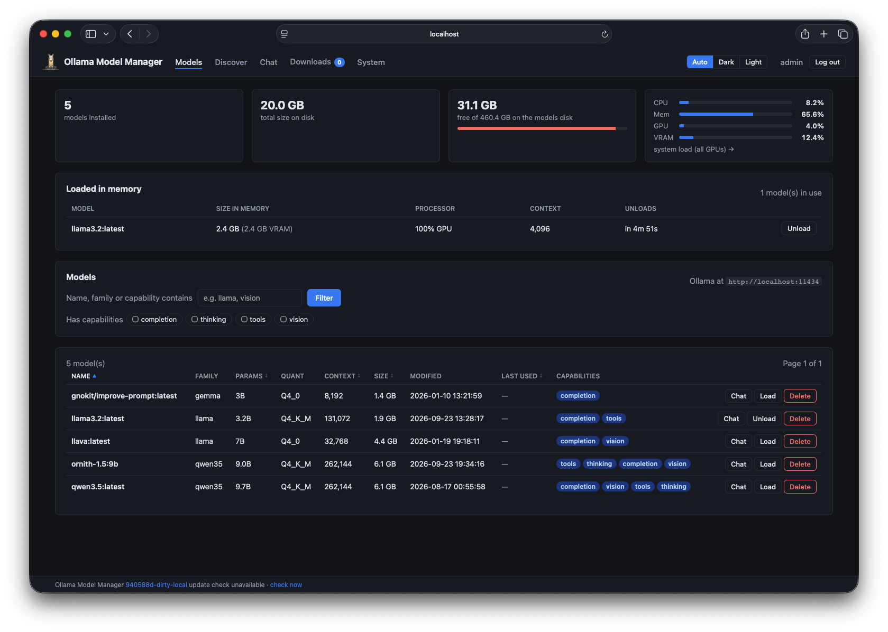
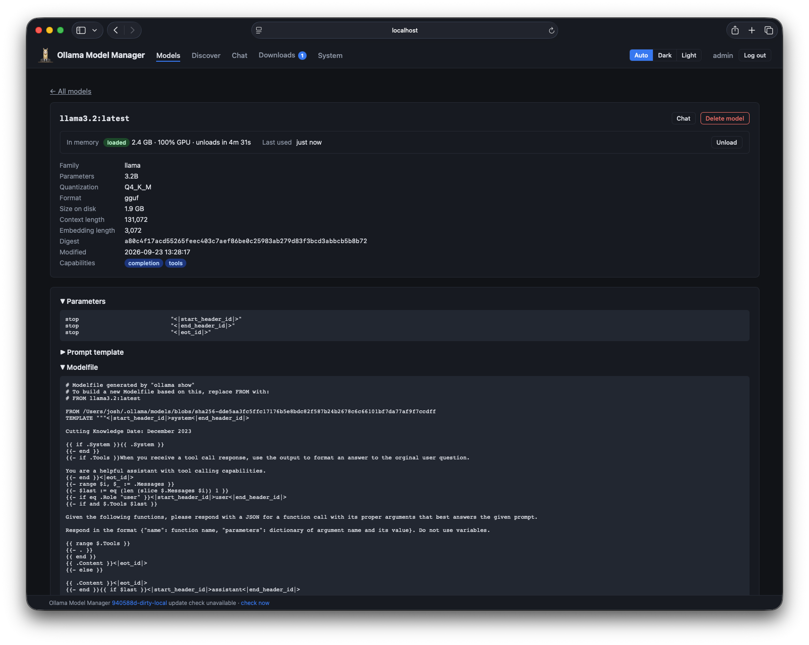
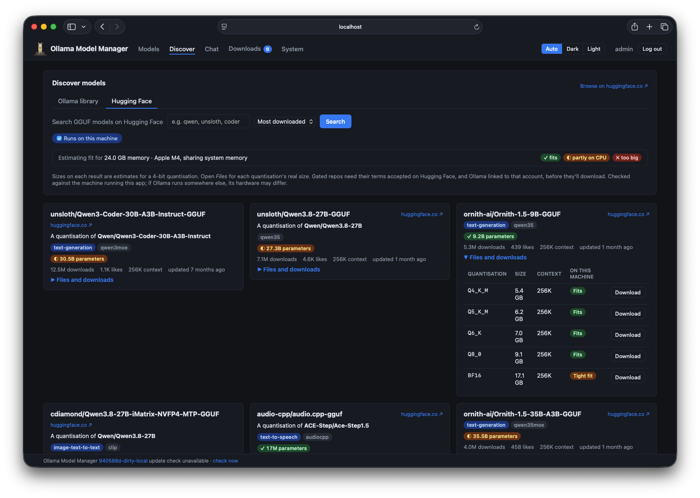
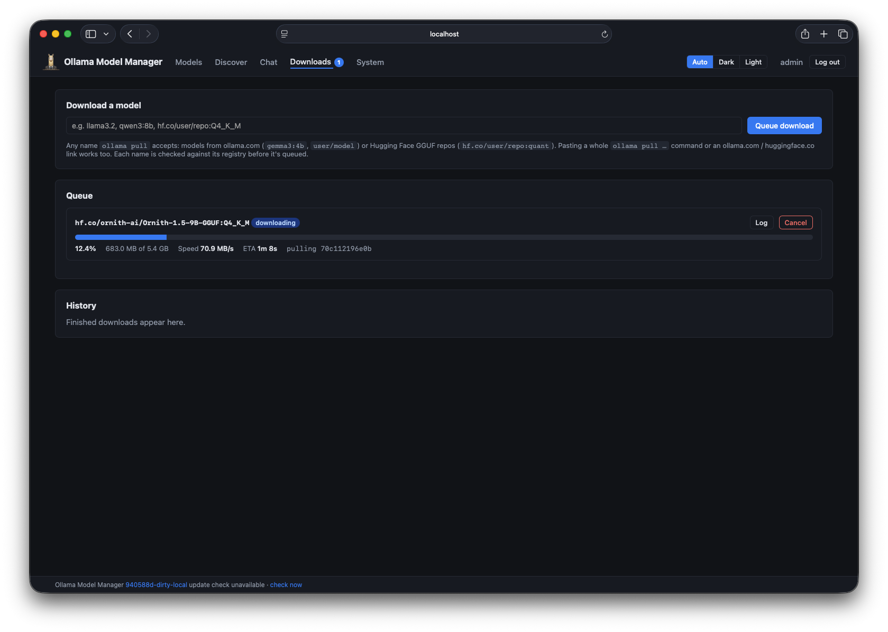
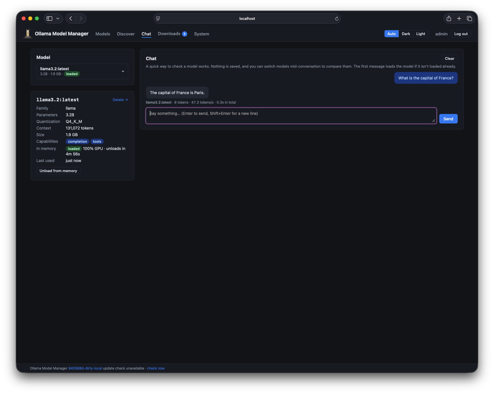
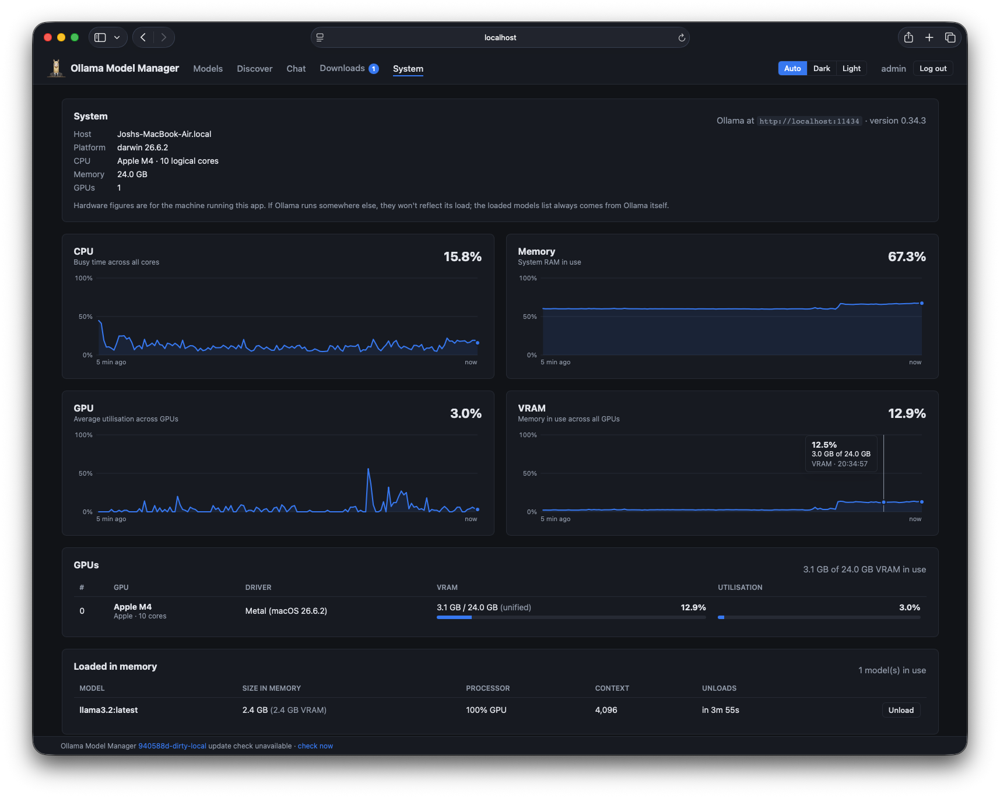

<p align="center">
  
</p>

<h1 align="center">Ollama Model Manager</h1>

<p align="center">
  A self-hosted web app for managing a local <a href="https://ollama.com">Ollama</a> instance: see what's installed and
  what's in memory, find and download new models that fit your hardware, and watch your system while they run.
</p>



## Why use it?

Ollama is great at running models, but leaves a couple of everyday jobs to you:

- **It doesn't track which models you use.** `ollama list` shows when each model was downloaded, not when it was last
  used, so a big library soon fills with models you tried once and forgot. Ollama Model Manager records when each
  model was last in memory, so you can see what earns its disk space.
- **It has no download queue.** `ollama pull` downloads one model at a time in your terminal, and you have to keep that
  terminal open until it finishes. Here you queue as many models as you like from the browser. They download one after
  another in the background, keep going when you close the tab, and pick up where they left off after a restart.

It also puts everything else in one place: finding models that fit your hardware on ollama.com and Hugging Face,
loading and unloading them, and watching CPU, GPU and memory while they run.

## Features

### Your models at a glance
- Every installed model with its family, parameter count, quantisation, context length, size, capabilities and when it
  was last used. Filter by name, family or capability, and sort by any column.
- Totals for your library, free space on the disk Ollama stores models on, and a live CPU, memory, GPU and VRAM tile.
- Delete models you no longer need (this can be turned off with `ALLOW_MODEL_DELETE=false`).

### Detailed model information
Each model has its own page with everything Ollama knows about it: architecture details, embedding length, digest,
parameters, prompt template and the full Modelfile.



### Load and unload models
- See which models are in memory, how much of each is on the GPU, their context size and when Ollama will unload them.
- Load a model ahead of time, choosing how long it stays loaded (Ollama's default, 30 minutes, 1 hour, 24 hours, or
  until you unload it), and unload models to free memory straight away.

### Usage tracking
Ollama Model Manager checks Ollama every 15 seconds for the models it has in memory and records when each was last
loaded. That's the **Last used** column: a good guide to which models you actually use, and which are just taking up
disk space. It doesn't see individual requests passing through Ollama, so a model counts as used whenever it was in
memory, not per prompt.

### Discover new models
Search the [Ollama library](https://ollama.com/search) and GGUF models on [Hugging Face](https://huggingface.co/models?library=gguf)
without leaving the app, and download them with one click.

- **Checked against your hardware.** The app reads your memory and GPUs and marks every model size and quantisation as
  ✓ fits in VRAM, ◐ runs partly on the CPU, or ✗ too big. Apple silicon's shared memory is taken into account.
  **Runs on this machine** (on by default) hides the ones that won't fit.
- **Every download option, with real sizes.** Expand a model to see all its tags (Ollama) or quantisations (Hugging
  Face), each with its download size, context length and whether it fits.
- Filter the Ollama library by capability (vision, tools, thinking, embedding, cloud); sort Hugging Face by downloads,
  trends, likes or newest.
- Models you've installed, queued or are downloading are marked as such.



Fit is an estimate (roughly the file size plus 20% for the context window and runtime). Treat ✓ as "should run
comfortably" rather than a guarantee.

### A download queue
- Queue any model `ollama pull` accepts: names like `qwen3:8b`, Hugging Face repos like `hf.co/user/repo:Q4_K_M`, or
  just paste an `ollama pull …` command or an ollama.com / huggingface.co link.
- Each name is checked with its registry before it's queued, so typos fail straight away. If a model looks too big for
  your disk or memory, you're asked before it's downloaded.
- Downloads run one at a time in the background, with live progress, speed and ETA. They carry on when you close the
  browser, and resume after a restart.
- Failed downloads show a log and suggestions for fixing them (such as updating Ollama, or getting access to a gated
  model), and can be retried with a corrected name.



### Chat with a model
A quick way to check a model works: chat with any installed model, switch models mid-conversation to compare them, and
see tokens, tokens per second and response time for each reply. Nothing is saved.



### System monitoring
Live graphs of CPU, memory, GPU and VRAM use over the last five minutes, each GPU's memory and utilisation, and what's
loaded, so you can watch what happens as models load and run. NVIDIA GPUs are read with `nvidia-smi`, AMD and Intel
GPUs from `/sys`, and Apple silicon natively.



### And also
- Sign-in required, with a username and password you can change from the Account page.
- Light, dark or automatic theme.
- A notice in the footer when a newer release is out.

## Running it

However you run it, the first start creates an `admin` account with a random password and prints it once:

```
==============================================================
  Initial admin account created
    username: admin
    password: <24 random characters>
  Change these from the Account page after logging in.
  This password won't be shown again.
==============================================================
```

Open http://localhost:8080 (or your server's address) and sign in with it. Lost it? Run the binary with
`reset-password` to get a new one (see [Resetting the password](#resetting-the-password)).

### Standalone binary (recommended on macOS)

Pre-built binaries for **Linux, macOS and Windows** (amd64 and arm64) are attached to each
[release](https://github.com/mophead64/ollama-model-manager/releases). There's nothing to install: download the archive
for your system, extract it and run it.

```sh
./ollama-model-manager            # macOS / Linux
ollama-model-manager.exe          # Windows
```

This is the best way to run it on a Mac: Docker on macOS runs in a VM and can't see the GPU, so only a native binary
shows Apple silicon GPU stats and fits models to your unified memory.

The database (`omm.db`) is created **next to the binary**, so put it in a folder you can write to, or set `DB_PATH`.

The binaries aren't code-signed yet, so the first run needs a nudge:
- **Windows:** if SmartScreen says it protected your PC, choose *More info* → *Run anyway*.
- **macOS:** run `xattr -d com.apple.quarantine ollama-model-manager` in the extracted folder, or try it once and then
  allow it under System Settings → Privacy & Security.

### Docker

Images for linux/amd64 and linux/arm64 are published at `ghcr.io/mophead64/ollama-model-manager`.

With Docker Desktop (macOS, Windows) or similar, where `host.docker.internal` reaches the host:

```sh
docker run -d --name ollama-model-manager -p 8080:8080 \
  -e OLLAMA_HOST=http://host.docker.internal:11434 \
  -v omm-data:/data \
  -v ~/.ollama/models:/models:ro \
  ghcr.io/mophead64/ollama-model-manager:latest

docker logs ollama-model-manager   # shows the admin password
```

On a Linux server with Ollama installed natively, share the host's network so the app can reach Ollama on
`localhost` (Ollama only listens there by default), and mount the Linux service's models folder:

```sh
docker run -d --name ollama-model-manager --network host \
  -v omm-data:/data \
  -v /usr/share/ollama/.ollama/models:/models:ro \
  ghcr.io/mophead64/ollama-model-manager:latest
```

The models folder mount is optional and read-only: it's only used to show free disk space.

### Docker Compose on Linux (with NVIDIA GPUs)

[`docker-compose-deploy-linux.yml`](docker-compose-deploy-linux.yml) is set up for a Linux server running Ollama
natively: it uses the host's network, mounts the Linux service's models folder, and passes NVIDIA GPUs through for GPU
stats.

```sh
docker compose -f docker-compose-deploy-linux.yml up -d
docker compose -f docker-compose-deploy-linux.yml logs   # shows the admin password
```

It needs the [NVIDIA Container Toolkit](https://docs.nvidia.com/datacenter/cloud-native/container-toolkit/latest/install-guide.html)
on the host; without an NVIDIA GPU, remove the `deploy:` block. AMD and Intel GPUs need nothing extra. Running the same
`up -d` again updates to the newest release.

### From source

With [Go](https://go.dev/doc/install) installed:

```sh
git clone https://github.com/mophead64/ollama-model-manager.git
cd ollama-model-manager

./run-local.sh              # macOS / Linux: builds and runs it natively
run-local.bat               # Windows

docker compose up --build   # or build and run the container
```

`run-local` keeps the database in `./data`. [`docker-compose.yml`](docker-compose.yml) builds the image from your
checkout and has comments for pointing it at your Ollama and models folder, and for NVIDIA GPU stats.

## Configuration

Everything is set with environment variables:

| Variable | Default | |
|---|---|---|
| `PORT` | `8080` | Port the web UI listens on |
| `OLLAMA_HOST` | `http://localhost:11434` | The Ollama server to manage |
| `DB_PATH` | `omm.db` beside the binary (`/data/omm.db` in Docker) | Where the database (accounts and download history) is kept |
| `MODELS_DIR` | auto-detected | Ollama's models folder, for the free disk space tile. Found automatically in the usual places and at `/models` |
| `ALLOW_MODEL_DELETE` | `true` | `false` hides the Delete buttons and refuses deletions |
| `HF_TOKEN` | not set | Optional Hugging Face read token (see below) |

Hardware stats and fit estimates are for the machine running this app. If you point `OLLAMA_HOST` at Ollama on another
machine, model management works as normal, but the System page and Discover's fit checks describe this machine, not
Ollama's.

## Gated and private Hugging Face models

Public Hugging Face models work with no setup. **Gated** models (such as Google's official Gemma GGUFs) and your
**private** repos need access set up in two places, for two different jobs:

1. **Ollama's key: needed to download them.** Ollama downloads models itself, and proves who it is to Hugging Face with
   its own key. Signed in as the admin, open **Account → Hugging Face**: it shows Ollama's public key to copy into your
   Hugging Face account under *Settings → SSH and GPG Keys*. Gated models also need their terms accepted once on the
   model's Hugging Face page. After that, Ollama can download everything that account can access.
2. **`HF_TOKEN`: optional, for browsing.** On its own, this app talks to Hugging Face anonymously, so Discover can't list
   private repos. Set `HF_TOKEN` to a Hugging Face *read* access token
   ([create one here](https://huggingface.co/settings/tokens)) and restart the app: Discover then includes the private
   repos it can see, and downloads are checked with it. The Account page confirms which account the token belongs to.

Both apply to everyone using the app: anyone who can sign in can download what the linked account can access, and see
what the token can see.

## Resetting the password

Run the binary with `reset-password`. It prints a new random password for the admin account and signs out every
session, and works whether the app is running or not:

```sh
./ollama-model-manager reset-password                                          # standalone
docker exec ollama-model-manager /ollama-model-manager reset-password          # Docker
```

For a standalone binary started with a custom `DB_PATH`, set the same `DB_PATH` when resetting.

## Verifying downloads

Each release lists SHA256 checksums of its binaries, and every binary and image has a build provenance attestation
showing it was built from this repository by its CI:

```sh
gh attestation verify ollama-model-manager-<version>-linux-amd64.tar.gz -R mophead64/ollama-model-manager
```

## License

[MIT](LICENSE)
