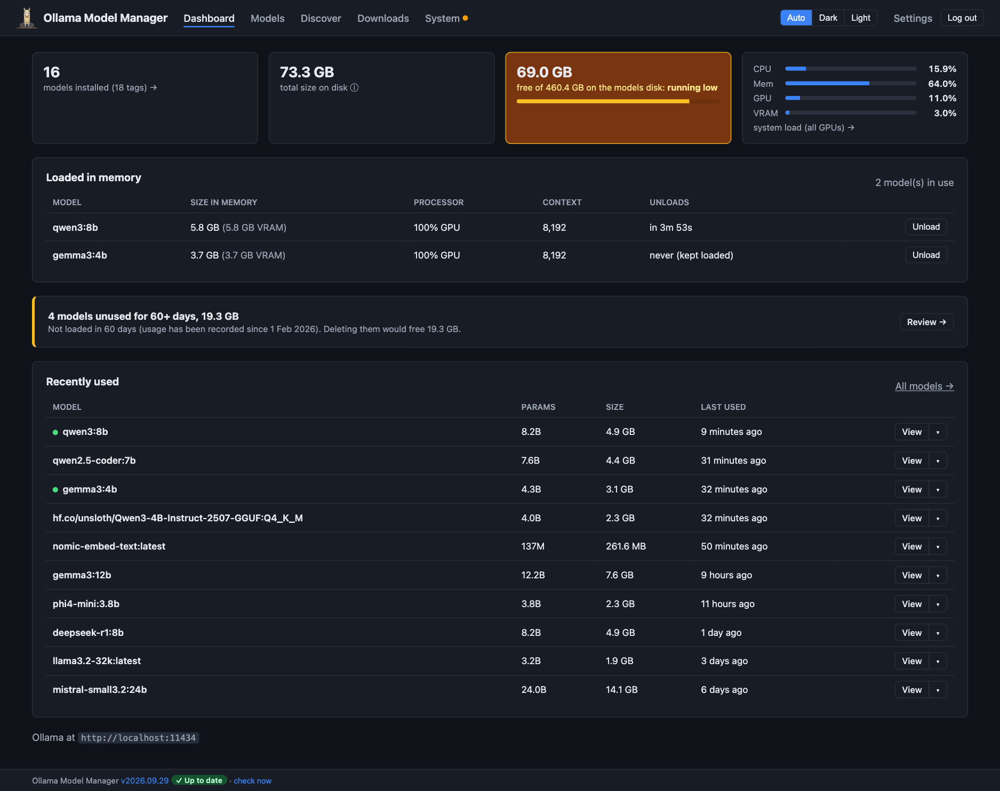
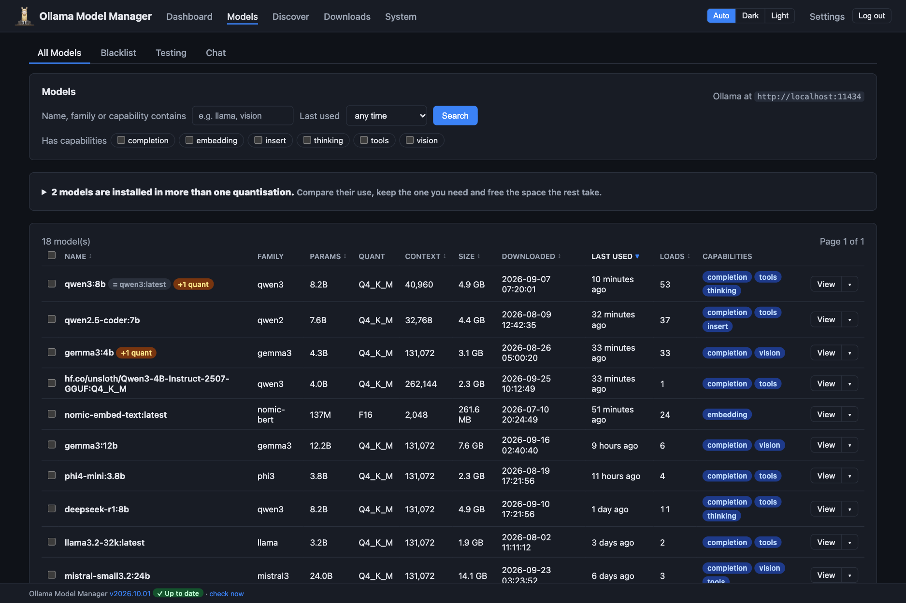
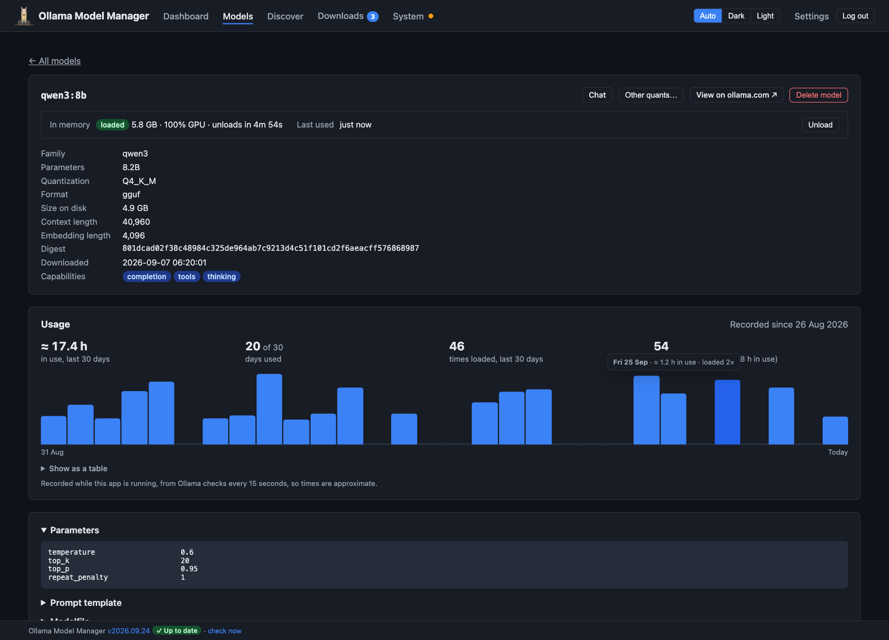
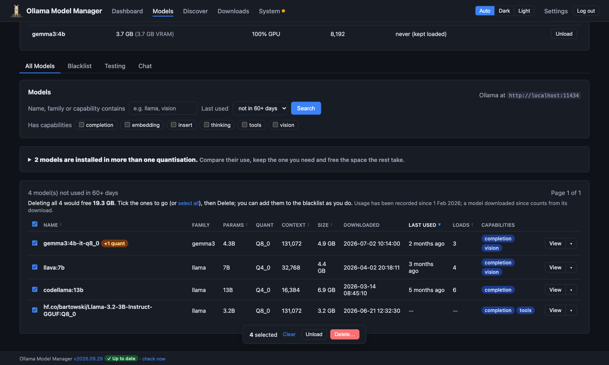
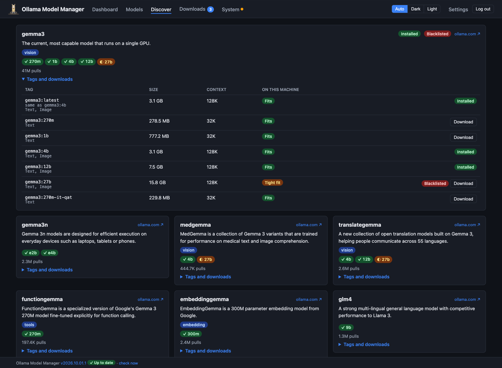
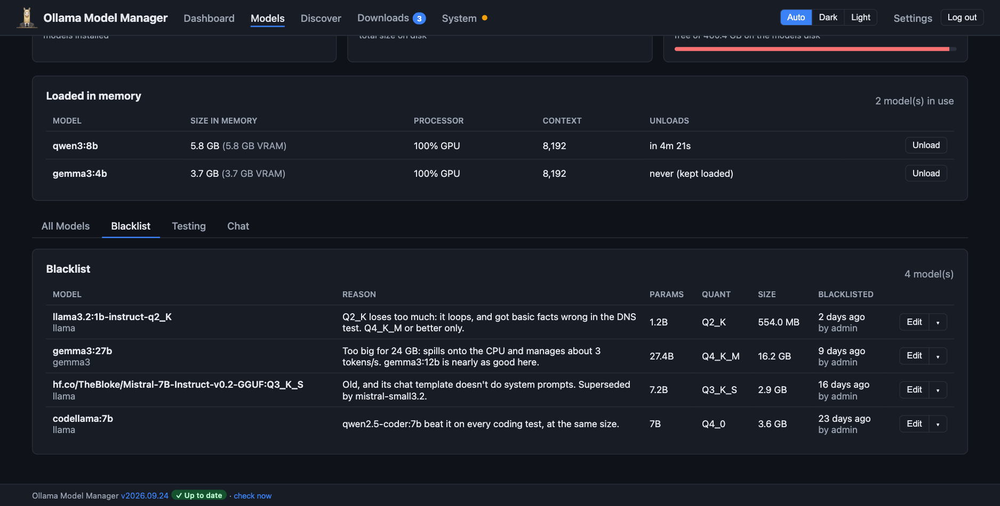
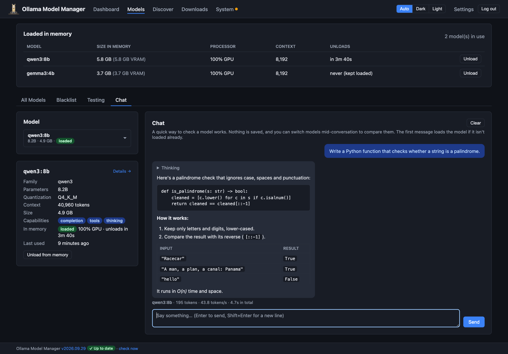
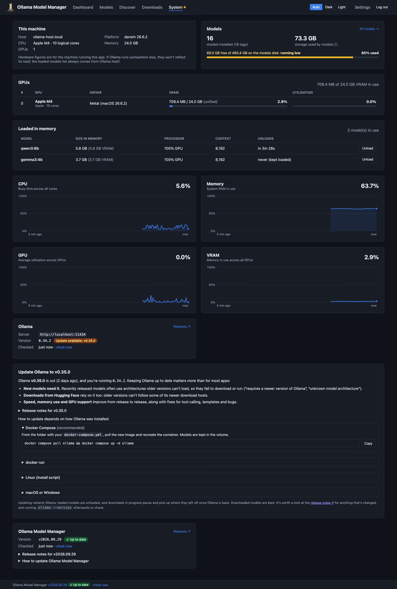

<p align="center">
  
</p>

<h1 align="center">Ollama Model Manager</h1>

<p align="center">
  A self-hosted, signed-in web app for running your <a href="https://ollama.com">Ollama</a> models: find and queue
  downloads that fit your hardware, see what you actually use, test models against each other, and keep a record of the
  ones that weren't worth keeping.
</p>



## What it adds to Ollama

Ollama is great at running models. Managing them is left to its command line, on the machine it runs on. Ollama Model
Manager fills in the rest:

| | Ollama on its own | With Ollama Model Manager |
|---|---|---|
| **Managing models** | `ollama list`, `ps` and `rm` in a terminal on the server | A web app you sign in to from any browser: what's installed, what's in memory and on the GPU, load, unload and delete |
| **Finding models** | Browse ollama.com or Hugging Face yourself, and guess what will fit | Search both from the app, with every size and quantisation checked against your memory and GPU |
| **Downloading** | `ollama pull`, one at a time, with the terminal kept open | A queue that runs in the background, carries on after a restart, and explains failures |
| **Knowing what you use** | When a model was downloaded | When it was last used, how often it's loaded, and how long it's in use each day |
| **Disk space** | `ollama list` sizes, which count files shared between models again for each | The real space used, exactly what a delete frees, the models you haven't used in months, and the ones you have in two quantisations, cleared out in one go |
| **Comparing models** | Try each one by hand and eyeball it | Tests: one prompt, many models, many runs, with speed and replies side by side |
| **Remembering what didn't work** | Nothing | A blacklist that keeps why you deleted a model, and warns you before you download it again |
| **Staying up to date** | Check the releases yourself | An orange dot when Ollama has an update, with how to install it |

## Features

### Your models, at a glance
The **dashboard** shows your library's size, free space on the disk Ollama uses, live CPU, memory, GPU and VRAM, what's
loaded in memory (and how much of it is on the GPU), and the models you've used most recently. The **Models** page lists
everything installed, with its family, size, quantisation, context length, capabilities, when it was downloaded, when
it was last used and how many times it's been loaded. Sort by size, parameters, context, download date, last use or
loads, filter by name, capability or how long it's gone unused, and click a name to copy it.



Each model's menu loads or unloads it (choosing how long it stays loaded), opens a chat, shows its **other quants** to
download, links to it on ollama.com or Hugging Face, or deletes it. Tick several to unload or delete them at once.

### Usage history
Ollama keeps no record of what you use. This app checks every 15 seconds and records when each model was last used, each
time it's loaded, and roughly how long it's in use each day, so you can see which models earn their disk space. Each
model's page has a 30-day chart alongside everything Ollama knows about it: architecture, parameters, template and
Modelfile.



### Reclaiming disk space
Sizes count each file once: `llama3.2:latest` and `llama3.2:3b` are one model, a variant made from another shares its
weights, and deleting a model says exactly how much it frees. The dashboard tells you when models have gone 60 days
unused, and the Models page filters to them (30, 60 or 90 days) to delete them in one go, adding them to the blacklist
if you like. Models installed in more than one quantisation are set side by side with how much you use each, and a link
to test them against each other. The free space tile turns amber, then red, as the disk fills, and downloads check
there's room for everything queued ahead of them.



**[Reclaiming disk space →](docs/disk-space.md)**

### Discover and download models
Search the [Ollama library](https://ollama.com/search) and GGUF models on
[Hugging Face](https://huggingface.co/models?library=gguf) without leaving the app. Every size and quantisation is marked
✓ fits in VRAM, ◐ partly on the CPU, or ✗ too big for your machine, with its real download size. Downloads go into a
queue that works through them in the background, with progress, speed and ETA, and suggestions for fixing any that fail.



**[Discovering and downloading models →](docs/discovery.md)**, including how to get at gated and private Hugging Face
models.

### Model testing
Send one prompt to several models, several times each, and compare them: tokens per second, reply length, response time
and load time, plus every reply to read side by side. Tests run in the background, one model at a time, unloading each
when it's done so the next gets the GPU to itself. Save a prompt, models and runs as a **template** to run the same
comparison again later.


**[Model testing →](docs/testing.md)**

### The blacklist
When you delete a model that wasn't any good, tick *Also add it to the blacklist* and say why. The model goes, but the
record stays: what it was, when, and why you dropped it. Discover marks blacklisted models (and can hide them), and
downloading one again asks first, showing the reason you gave.



**[The blacklist →](docs/blacklist.md)**

### Chat with a model
A quick way to check a model works: chat with any installed model, switch models mid-conversation to compare them, and
see tokens, tokens per second and response time for each reply. Replies (here and in test results) are shown as
Markdown: lists, tables and code blocks. Nothing is saved.



### System monitoring and updates
Live graphs of CPU, memory, GPU and VRAM use, each GPU's memory and utilisation, what's loaded, and how many models you
have and the space they take. NVIDIA GPUs are read with `nvidia-smi`, AMD and Intel GPUs from `/sys`, and Apple silicon
natively. The System page also checks for new releases of Ollama and of this app. For Ollama, it says why they matter
(new models often need them) and shows how to update for Docker, the Linux install script (backing up your
`ollama.service` settings first), macOS and Windows; for this app, it shows the release notes, which say how to update.



### And also
- Sign-in required, with a username and password you can change from Settings.
- **Settings → Ollama settings** checks whether Ollama is open to your network, suggests a context length, flash
  attention, KV cache and parallel requests for your hardware, and gives copyable steps to apply them with systemd,
  Docker, the macOS app or Windows.
- Light, dark or automatic theme.
- A green ✓ in the footer when you're running the latest release of this app, or a link to the new one.
- Deleting models can be turned off with `ALLOW_MODEL_DELETE=false`.

## Running it

However you run it, the first start creates an `admin` account with a random password and prints it once:

```
==============================================================
  Initial admin account created
    username: admin
    password: <24 random characters>
  Change these from the Settings page after logging in.
  This password won't be shown again.
==============================================================
```

Open http://localhost:8080 (or your server's address) and sign in with it. Lost it? Run the binary with
`reset-password` to get a new one (see [Resetting the password](#resetting-the-password)).

### Standalone binary (recommended on macOS)

Pre-built binaries for **Linux, macOS and Windows** (amd64 and arm64) are attached to each
[release](https://github.com/mophead64/ollama-model-manager/releases). There's nothing to install: download the archive
for your system, extract it and run it.

```sh
./ollama-model-manager            # macOS / Linux
ollama-model-manager.exe          # Windows
```

This is the best way to run it on a Mac: Docker on macOS runs in a VM and can't see the GPU, so only a native binary
shows Apple silicon GPU stats and fits models to your unified memory.

The database (`omm.db`) is created **next to the binary**, so put it in a folder you can write to, or set `DB_PATH`.

The binaries aren't code-signed yet, so the first run needs a nudge:
- **Windows:** if SmartScreen says it protected your PC, choose *More info* → *Run anyway*.
- **macOS:** run `xattr -d com.apple.quarantine ollama-model-manager` in the extracted folder, or try it once and then
  allow it under System Settings → Privacy & Security.

### Docker

Images for linux/amd64 and linux/arm64 are published at `ghcr.io/mophead64/ollama-model-manager`.

With Docker Desktop (macOS, Windows) or similar, where `host.docker.internal` reaches the host:

```sh
docker run -d --name ollama-model-manager -p 8080:8080 \
  -e OLLAMA_HOST=http://host.docker.internal:11434 \
  -e TZ=Europe/London \
  -v omm-data:/data \
  -v ~/.ollama/models:/models:ro \
  ghcr.io/mophead64/ollama-model-manager:latest

docker logs ollama-model-manager   # shows the admin password
```

On a Linux server with Ollama installed natively, share the host's network so the app can reach Ollama on
`localhost` (Ollama only listens there by default), and mount the Linux service's models folder:

```sh
docker run -d --name ollama-model-manager --network host \
  -e TZ=Europe/London \
  -v omm-data:/data \
  -v /usr/share/ollama/.ollama/models:/models:ro \
  ghcr.io/mophead64/ollama-model-manager:latest
```

The models folder mount is optional and read-only: it's only used to show free disk space. Set `TZ` to your time zone:
containers run on UTC otherwise, so times and usage history's days would be off.

### Docker Compose on Linux (with NVIDIA GPUs)

[`docker-compose-deploy-linux.yml`](docker-compose-deploy-linux.yml) is set up for a Linux server running Ollama
natively: it uses the host's network, mounts the Linux service's models folder, and passes NVIDIA GPUs through for GPU
stats.

```sh
docker compose -f docker-compose-deploy-linux.yml up -d
docker compose -f docker-compose-deploy-linux.yml logs   # shows the admin password
```

It needs the [NVIDIA Container Toolkit](https://docs.nvidia.com/datacenter/cloud-native/container-toolkit/latest/install-guide.html)
on the host; without an NVIDIA GPU, remove the `deploy:` block. AMD and Intel GPUs need nothing extra. Running the same
`up -d` again updates to the newest release.

### From source

With [Go](https://go.dev/doc/install) installed:

```sh
git clone https://github.com/mophead64/ollama-model-manager.git
cd ollama-model-manager

./run-local.sh              # macOS / Linux: builds and runs it natively
run-local.bat               # Windows

docker compose up --build   # or build and run the container
```

`run-local` keeps the database in `./data`. [`docker-compose.yml`](docker-compose.yml) builds the image from your
checkout and has comments for pointing it at your Ollama and models folder, and for NVIDIA GPU stats.

## Configuration

Everything is set with environment variables:

| Variable | Default | |
|---|---|---|
| `PORT` | `8080` | Port the web UI listens on |
| `OLLAMA_HOST` | `http://localhost:11434` | The Ollama server to manage |
| `DB_PATH` | `omm.db` beside the binary (`/data/omm.db` in Docker) | Where the database is kept: accounts, downloads, usage history, tests and the blacklist |
| `MODELS_DIR` | auto-detected | Ollama's models folder, for the free disk space tile and exact storage figures (see [Disk space](docs/disk-space.md#how-much-space-your-models-take)). Found automatically in the usual places and at `/models` |
| `ALLOW_MODEL_DELETE` | `true` | `false` hides the Delete buttons and refuses deletions |
| `HF_TOKEN` | not set | Optional Hugging Face read token, for browsing private repos (see [the guide](docs/discovery.md#gated-and-private-hugging-face-models)) |
| `TZ` | the system's (UTC in Docker) | Time zone for the times shown and usage history's days, e.g. `Europe/London` |
| `TRUSTED_PROXIES` | not set | Behind a reverse proxy, its address or range (e.g. `172.18.0.0/16`, comma-separated for several), so logins are rate limited and logged by the browser's address rather than the proxy's |

Hardware stats and fit estimates are for the machine running this app. If you point `OLLAMA_HOST` at Ollama on another
machine, model management works as normal, but the System page and Discover's fit checks describe this machine, not
Ollama's.

Settings → Configuration shows each of these as it took effect: set, defaulted or auto-detected.

## Gated and private Hugging Face models

Public Hugging Face models work with no setup. Gated models (such as Google's official Gemma GGUFs) and private repos
need Ollama linking to a Hugging Face account with access, and gated ones need access granted on Hugging Face first. See
[Gated and private models](docs/discovery.md#gated-and-private-hugging-face-models) for the steps.

## Resetting the password

Run the binary with `reset-password`. It prints a new random password for the admin account and signs out every
session, and works whether the app is running or not:

```sh
./ollama-model-manager reset-password                                          # standalone
docker exec ollama-model-manager /ollama-model-manager reset-password          # Docker
```

For a standalone binary started with a custom `DB_PATH`, set the same `DB_PATH` when resetting.

## Health check

`GET /healthz` needs no sign-in, for uptime monitors: it answers `200` with `{"status":"ok",...}` when the app's
database and Ollama are both reachable, and `503` saying which isn't otherwise. The Docker image's `HEALTHCHECK` runs
the binary's `healthcheck` command, which asks it (the image has no `curl`):

```sh
./ollama-model-manager healthcheck    # exit status 0 when healthy, 1 when not
```

## Verifying downloads

Each release lists SHA256 checksums of its binaries, and every binary and image has a build provenance attestation
showing it was built from this repository by its CI:

```sh
gh attestation verify ollama-model-manager-<version>-linux-amd64.tar.gz -R mophead64/ollama-model-manager
```

## License

[MIT](LICENSE)
