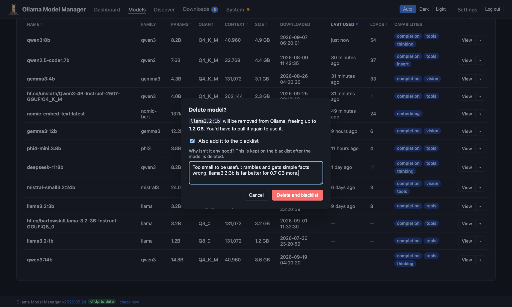
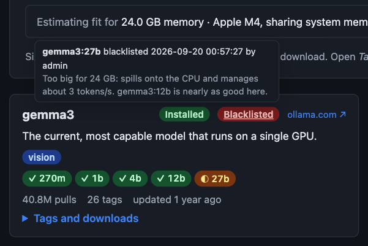
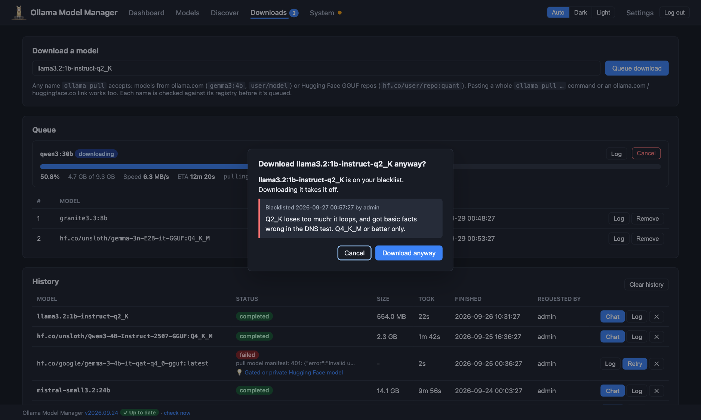

# The blacklist

[← Back to the README](../README.md)

Trying models is how you find good ones, but it leaves a trail: a quantisation that lost too much quality, a model too
big for your GPU, one that rambled or got facts wrong. Delete them and, a few months later, it's easy to forget why and
download the same thing again. The blacklist keeps the record: the model can go, but what it was, when, and why you
dropped it stay, and the app warns you before you download it again.

- [Adding a model](#adding-a-model)
- [The Blacklist tab](#the-blacklist-tab)
- [How it keeps you from downloading it again](#how-it-keeps-you-from-downloading-it-again)
- [What counts as the same model](#what-counts-as-the-same-model)

## Adding a model

A model goes on the blacklist when you delete it. In the **Delete model?** dialog (from a model's menu on the dashboard
or Models page, or its own page), tick **Also add it to the blacklist** and say why. The button becomes **Delete and
blacklist**.

What's recorded:

- **The reason**, in your own words. Be specific: "Q2_K loops and gets facts wrong" is more use in six months than
  "bad". The reason is optional, but it's the point of the blacklist.
- **What the model was**: its family, parameter count, quantisation, size and digest, copied before it's deleted, so
  they're kept after the model has gone.
- **Who** blacklisted it, and **when**.

If the model can't be deleted, it isn't blacklisted either. Blacklisting the same model again replaces its entry.

## The Blacklist tab

**Models → Blacklist** lists every entry, newest first, with the reason and the details kept.

Each entry's button:

- **Edit** changes the reason: say you've found out more, or want to note what replaced it.
- **Download** downloads it again. It asks first, since that takes it off the blacklist.
- **Remove** takes it off the blacklist without downloading anything. It asks first too.

## How it keeps you from downloading it again

**In Discover**, a model with any tag or quantisation on your blacklist shows a red **Blacklisted** badge on its card, and
on each blacklisted tag in its list. Hover over the badge to see when it was blacklisted, by whom, and why. Tick **Hide
blacklisted** to leave those models out of the results altogether (a model is hidden if even one of its quantisations
is on the list).

**When you download it**, from Discover, Other quants or the Downloads page, you're asked first, with the reason you
gave. **Download anyway** downloads it and takes it off the blacklist; **Cancel** leaves both alone.

## What counts as the same model

Entries are matched by name, the way Ollama sees names:

- `gemma3` is the same as `gemma3:latest`, and Hugging Face names match whatever their case.
- A **tag** is one download. Blacklisting `llama3.2:1b-instruct-q2_K` doesn't blacklist `llama3.2:3b`: other sizes
  and quantisations of the same model are still fine to download. In Discover, the model's card is still marked, so you
  know one of its downloads is on the list.
- Tags that are the same download under another name (`latest` and `8b`, say) are matched too, in Discover's tag
  lists, by their digest.
