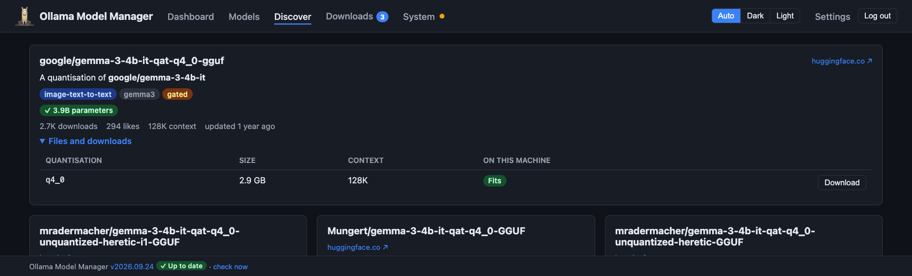
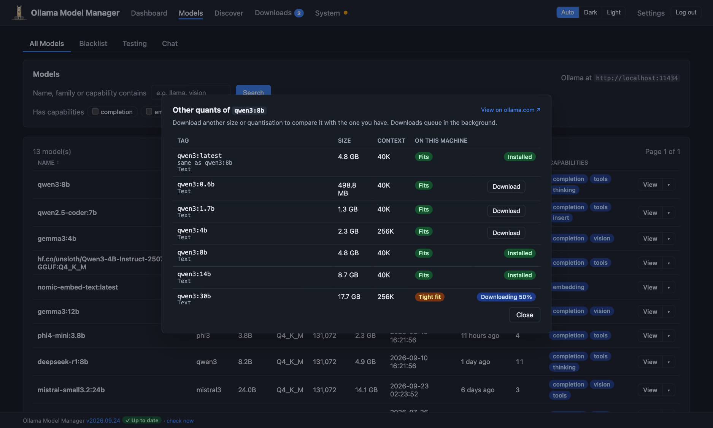
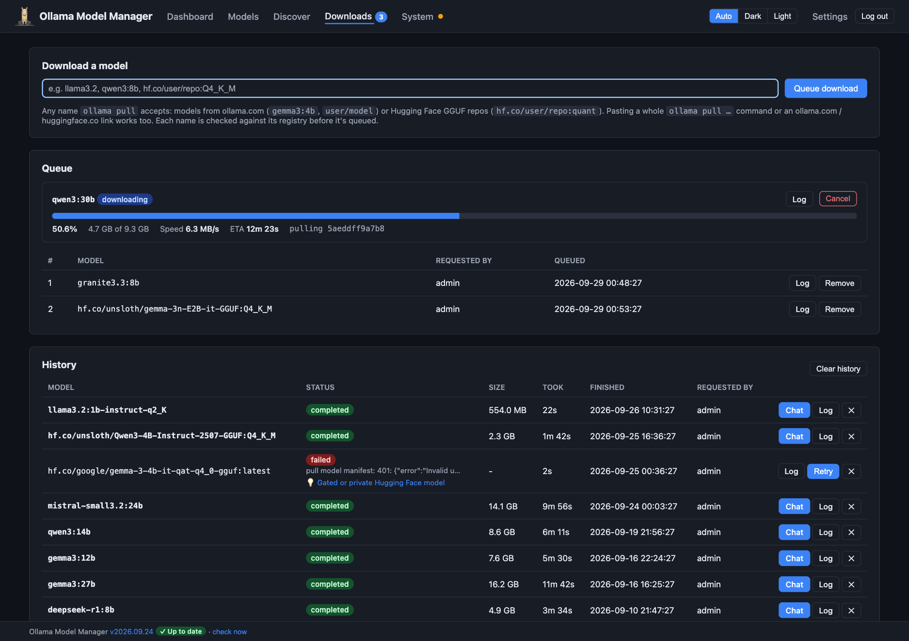
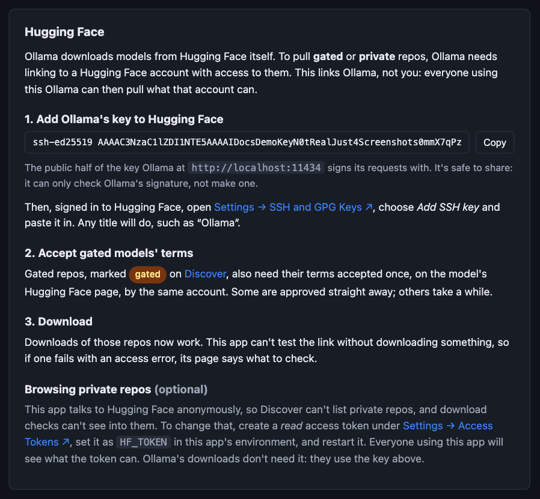

# Discovering and downloading models

[← Back to the README](../README.md)

Ollama Model Manager lets you find models on ollama.com and Hugging Face, check which ones your machine can run, and
download them through a queue, all from the browser.

- [Searching the Ollama library](#searching-the-ollama-library)
- [Searching Hugging Face](#searching-hugging-face)
- [Will it fit?](#will-it-fit)
- [Other quants of a model you have](#other-quants-of-a-model-you-have)
- [The download queue](#the-download-queue)
- [Gated and private Hugging Face models](#gated-and-private-hugging-face-models)

## Searching the Ollama library

**Discover → Ollama library** searches [ollama.com](https://ollama.com/search). Each result shows its description,
capabilities (vision, tools, thinking, embedding, cloud) and its sizes, each marked with whether it fits (see
[below](#will-it-fit)). Results load as you scroll.

Open **Tags and downloads** on a result to see every tag: its real download size, context length, whether it fits,
and a **Download** button. Tags that are the same download under another name (such as `latest`) say which tag they
match. Tags you already have are marked **Installed**, ones in the queue show their progress, and ones on your
[blacklist](blacklist.md) are marked **Blacklisted**.


ollama.com has no API for this, so the app reads its web pages. If ollama.com changes its layout in a way the app can't
read, Discover says *couldn't read ollama.com (its layout may have changed)* rather than showing no results, and an
update to this app will be needed. Hugging Face searches, and downloading by name from the Downloads page, still work
meanwhile.

The filters above the results:

- **Has**: only models with every capability ticked. *cloud* shows ollama.com's cloud models, which don't run locally.
- **Runs on this machine** (on by default): hides models with no size that would run here.
- **Hide blacklisted**: hides any model with a tag or quantisation on your blacklist.

## Searching Hugging Face

**Discover → Hugging Face** searches the GGUF models on [Hugging Face](https://huggingface.co/models?library=gguf),
sorted by downloads, trending, likes or newest. Each result shows the model it's a quantisation of, its pipeline and
architecture, an estimated size from its parameter count, its context length, and a **gated** badge if you need to ask
for access (see [gated models](#gated-and-private-hugging-face-models)).

Open **Files and downloads** to see each quantisation (Q4_K_M, Q8_0 and so on) with its real size and fit. Files split
into several parts, and vision projectors (which aren't models on their own), are handled for you.



## Will it fit?

The app reads your machine's memory and GPUs, and marks every size and quantisation as:

- **✓ fits**: it should fit in VRAM (on Apple silicon, in the roughly three quarters of memory macOS lets the GPU use),
- **◐ partly on CPU**: it'll run, but part of it will sit in system RAM and run on the CPU, which is much slower,
- **✗ too big**: it won't fit in memory at all.

The estimate is the download size plus about 20% for the context window and runtime. Treat ✓ as "should run
comfortably" rather than a guarantee: a long context window uses more. The check is against the machine running this
app, so if `OLLAMA_HOST` points at Ollama on another machine, it describes the wrong one.

## Other quants of a model you have

Each installed model's menu (on the dashboard, the Models page and the model's own page) has **Other quants…**. It lists
every tag (for ollama.com models) or quantisation (for Hugging Face models) of that model, with the one you have
marked, so you can download a bigger or smaller one to compare. **View on ollama.com / Hugging Face** opens its page
there.



## The download queue

Downloads go into a queue on the **Downloads** page, from Discover, from Other quants, or by typing a name. Anything
`ollama pull` accepts works: `qwen3:8b`, `user/model`, `hf.co/owner/repo:Q4_K_M`, a whole `ollama pull …` command, or
an ollama.com or huggingface.co link.

- **Checked first.** Each name is checked with its registry before it's queued, so a typo fails straight away. If a
  model looks too big for your disk or memory, or it's on your [blacklist](blacklist.md), you're asked before it's
  queued. The disk check counts what's already queued: with 50 GB free and two 20 GB downloads ahead of it, a third
  is flagged then, rather than failing when the disk fills.
- **One at a time, in the background.** Downloads carry on when you close the browser, with live progress, speed and
  ETA, and a count on the nav. If this app restarts, an interrupted download picks up where it left off.
- **Failures explained.** A failed download keeps its log, and suggests what to do for the common causes: a model or tag
  that doesn't exist, a gated or private repo, a model that needs a newer Ollama, a full disk, or Ollama or the network
  being unreachable. **Retry** runs it again (Ollama keeps what it had already downloaded), and can correct the name
  first.



## Gated and private Hugging Face models

Most Hugging Face models are public and need no setup. Two kinds need more:

- **Gated** models (such as Google's official Gemma GGUFs, or Meta's Llama repos) are public, but you have to accept
  their terms, or ask for access, before downloading them. Discover marks them **gated**.
- **Private** repos are yours (or your organisation's), and only your account can see them.

For both, Ollama needs to be linked to a Hugging Face account that has access. It's Ollama that downloads models, not
this app, and Ollama proves who it is with its own key, not a password. So:

### 1. Get access on Hugging Face

Sign in to Hugging Face and open the model's page (the ↗ link on its Discover result). A gated model shows a box asking
you to accept its licence or share your contact details: do that. Some repos grant access straight away; others are
reviewed by their owner, which can take anything from minutes to days. The page says when you have access. Private
repos just need your account (or organisation) to own them.

Do this **before** queuing the download: until you have access, it fails with an access error.

### 2. Link Ollama to that account

Signed in as the admin, open **Settings → Hugging Face**. It shows Ollama's public key, with a **Copy** button. On Hugging
Face, open [Settings → SSH and GPG Keys](https://huggingface.co/settings/keys), choose **Add SSH key**, and paste it in
(any title will do, such as "Ollama").



If the page can't show the key (Ollama only reports it while it isn't signed in to ollama.com), print it on the machine
running Ollama:

```sh
cat ~/.ollama/id_ed25519.pub                                 # Ollama installed for your user (macOS, Windows, Linux)
sudo cat /usr/share/ollama/.ollama/id_ed25519.pub            # Ollama's Linux service
docker exec <ollama-container> cat /root/.ollama/id_ed25519.pub   # Ollama in Docker
```

The key is safe to share: it can only check Ollama's signature, not make one. This links **Ollama**, not you, so
everyone using this Ollama can then download what that Hugging Face account can.

### 3. Download

Queue the download as normal. If it still fails with an access error, the download's page lists what to check: usually
that access hasn't been granted yet, or the key was added to a different account.

### Browsing private repos (optional)

Downloads only need the key above. But this app searches Hugging Face anonymously, so Discover can't list your private
repos. To include them, create a *read* access token under
[Settings → Access Tokens](https://huggingface.co/settings/tokens) on Hugging Face, set it as `HF_TOKEN` in this app's
environment, and restart it. Settings → Hugging Face then confirms which account the token belongs to. Everyone using
this app sees what the token can see.
