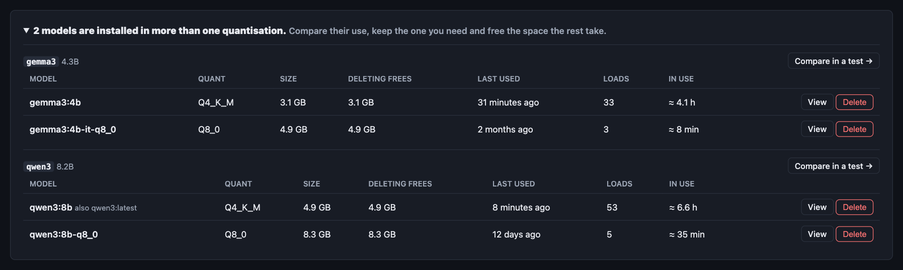
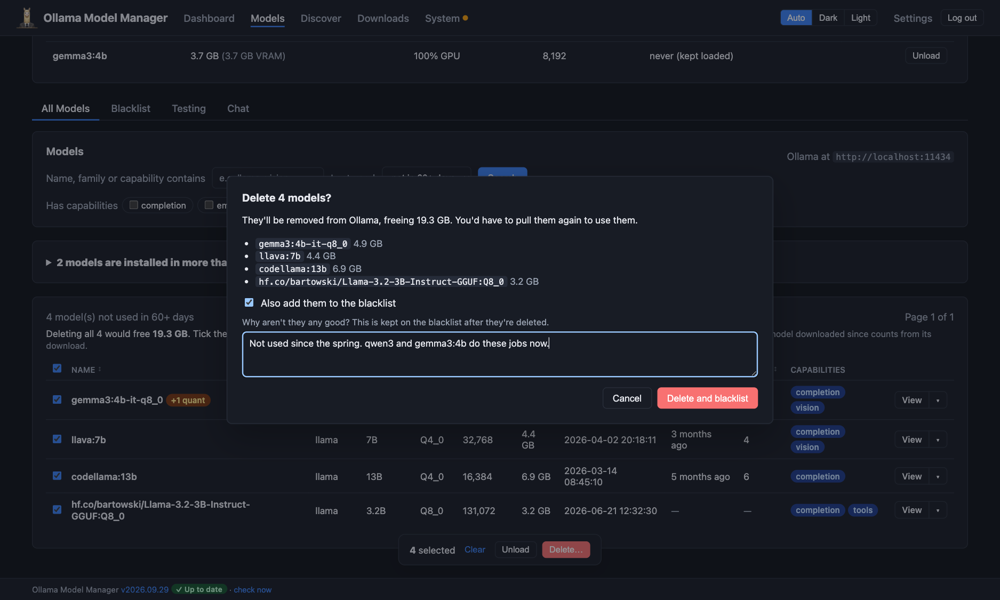

# Disk space

[← Back to the README](../README.md)

Models are big, and they pile up: a quantisation tried for a test, a model downloaded for one job, a second copy under
another name. Ollama Model Manager shows how much space your models really take, which ones you've stopped using, and
which you have in more than one quantisation, and lets you clear them out in one go.

- [How much space your models take](#how-much-space-your-models-take)
- [Models you don't use](#models-you-dont-use)
- [Models in more than one quantisation](#models-in-more-than-one-quantisation)
- [Deleting several models at once](#deleting-several-models-at-once)
- [Running low](#running-low)

## How much space your models take

Ollama stores each file a model is made of (its weights, template, licence and parameters) once, however many models
use it. Adding up the sizes `ollama list` shows counts those files again for every name they appear under, so this app
works the figures out from the files themselves:

- **Tags of the same model count once.** `llama3.2:latest` and `llama3.2:3b` are the same download under two names, so
  they're one model, not two. The dashboard says *16 models installed (18 tags)* when some models have more than one
  name, and the Models page marks each with a grey badge naming its other tag, such as **= llama3.2:3b**.
- **Shared files count once.** A variant made from another model (`llama3.2-32k`, say, with a longer context) keeps the
  original's weights, so its size on disk is only what's different.
- **Deleting says exactly what it frees.** The delete dialogs say how much space deleting a model frees: only the files
  no other model uses. Deleting one name of a model that has another frees nothing, and the dialog says so.

This needs this app to see Ollama's models folder (`MODELS_DIR`; it's found automatically in the usual places, and at
`/models` in Docker). Without it, tags of the same model are still counted once, but files shared between different
models can't be seen, so totals may be a little high: the total is marked *(estimate)* and the delete dialogs say
"freeing *up to*".

## Models you don't use

The app records when each model is used (see [Usage history](../README.md#usage-history)), so it can tell which ones
haven't been. When any models have gone 60 days without being used, the dashboard says how many, and how much space
deleting them would free.

**Review** opens the Models page filtered to them. The **Last used** filter there offers *not in 30+*, *60+* and *90+
days*; with one chosen, the list says how much deleting them all would free, and **select all** ticks them, ready to
[delete](#deleting-several-models-at-once).

A model counts as unused when none of these is within the period:

- its last use, under any of its names,
- when it was downloaded, so a model you've only just pulled isn't on the list,
- when this app started recording usage. Usage is only seen while the app is running, so a new install doesn't call
  anything unused until it's been watching for that long. The list says when recording began.

## Models in more than one quantisation

Comparing quantisations (Q4_K_M against Q8_0, say) is a good way to choose, but afterwards it's easy to keep both. When
you have a model in more than one quantisation, the Models page says so above the list, and each one has an orange
**+1 quant** badge. Open the note to see them side by side:

- **Deleting frees**: the space you'd get back.
- **Last used**, **Loads** and **In use**: how much you actually use each one, counting all its names.
- **Compare in a test**: opens a [test](testing.md) with them all ticked, to see what the bigger one buys you before
  choosing.
- **Delete**: deletes that one. If it's listed under more than one name (`qwen3:8b`, also `qwen3:latest`), all of them
  are deleted, since deleting just one name would free nothing.

Models count as the same when they come from the same place (`qwen3`, or the same Hugging Face repo) with the same
parameter count, in different quantisations.

## Deleting several models at once

Tick models on the Models page (or tick the box in the header for the whole page) and a bar appears at the bottom:

- **Select all *N* matching** (when the list runs to more than one page) ticks every model the current filter
  matches, on every page.
- **Unload** unloads whichever of them are loaded in memory.
- **Delete…** lists them, with how much space deleting them frees, and asks first. Tick **Also add them to the
  blacklist** to [blacklist](blacklist.md) them as they go, with one reason for them all.

The selection is kept as you sort, filter and page through the list. If any can't be deleted, the others still are, and
the page says which failed and why.

## Running low

The free space tile on the dashboard and Models page (and the bar on the System page) turns **amber** when the disk Ollama uses is running low
(under 50 GB or 15% free) and **red** when it's nearly full (under 10 GB or 5%).

Downloads check the space before they're queued, counting what the downloads already queued will take: with 50 GB free
and two 20 GB downloads queued, a third is flagged, rather than failing when the disk fills partway through. You're
asked whether to queue it anyway (see [the download queue](discovery.md#the-download-queue)).
