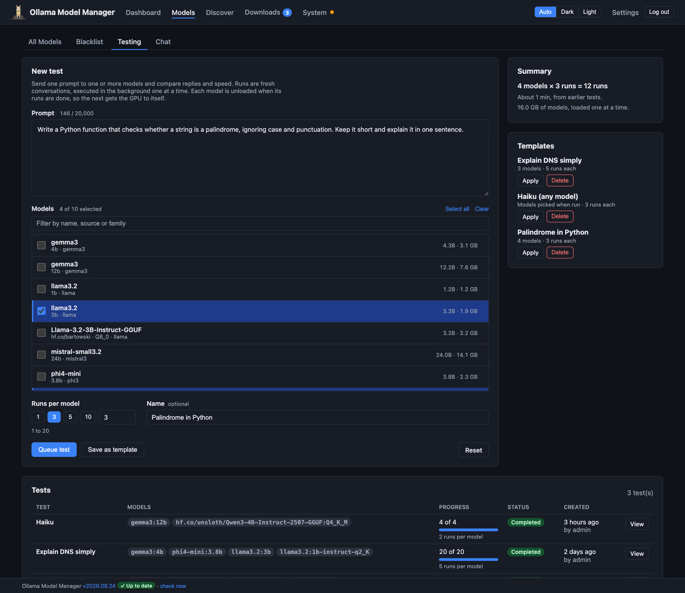
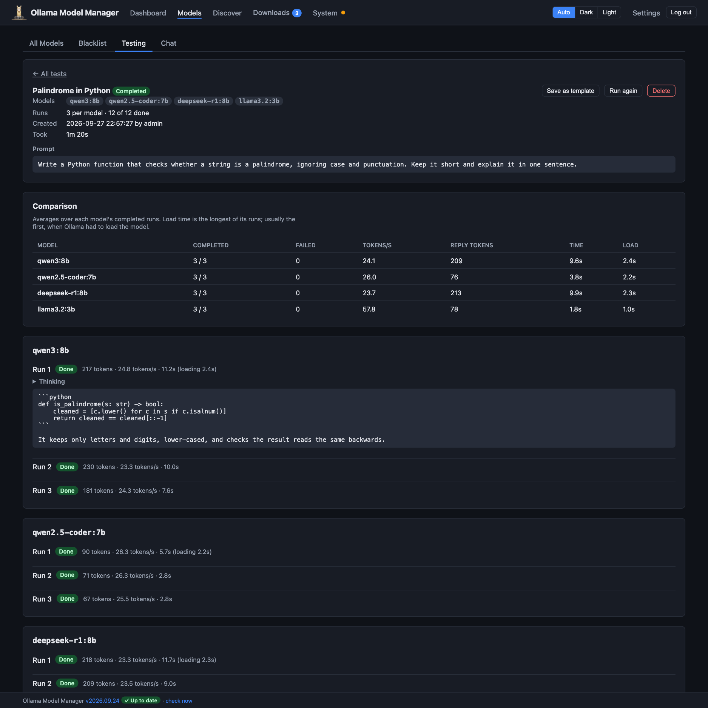

# Model testing

[← Back to the README](../README.md)

Choosing between models, or between quantisations of one model, usually means pasting the same prompt into each by hand
and eyeballing the answers. **Models → Testing** does it for you: it sends one prompt to several models, several times
each, and keeps every reply with its timings, so you can compare their speed and output side by side.

- [Creating a test](#creating-a-test)
- [Templates](#templates)
- [How a test runs](#how-a-test-runs)
- [Reading the results](#reading-the-results)
- [Tips for fair comparisons](#tips-for-fair-comparisons)

## Creating a test

The **New test** form has:

- **Prompt**: what to send. Each run sends it as a fresh conversation, so runs don't influence each other.
- **Models**: up to 10 of your installed models that can chat. Filter the list by name, source or family, and use
  **Select all** or **Clear**. Models are grouped by family, smallest first, so comparable ones sit together. A model
  that won't fit fully in your GPU's memory says so, since it'll run slower.
- **Runs per model**: 1 to 20, with presets for 1, 3, 5 and 10. More runs smooth out the variation between one reply
  and the next.
- **Name**: optional. Without one, the test is named after the first line of the prompt.

The **Summary** beside the form shows what you're about to queue: models × runs, an estimate of how long it'll take
(from how long those models took in earlier tests), the total size of the models, and a warning for any that won't fit
in VRAM. **Queue test** stays disabled until you've picked a model and written a prompt; hover over it to see what's
missing. **Reset** clears the form.

## Templates

A template saves a prompt, a set of models and a number of runs, so you can run the same comparison again: after
downloading a new model, updating Ollama, or changing a model's parameters.

- **Save as template** on the form saves what's in it. Models are optional, so you can keep a prompt you like and pick
  the models each time.
- **Save as template** on a finished test's page saves that test's settings.
- **Apply** on a template fills the form in from it, ready to adjust and queue. If a model it names has been deleted
  since, the form says so and leaves it out.

## How a test runs

Tests queue and run in the background, one at a time, like downloads, so you can close the browser. Within a test:

- Each model does all its runs before the next model starts, so it only has to load once. Its first run includes the
  load time; the rest don't.
- When a model has finished its runs, it's **unloaded**, so the next model has the GPU to itself rather than sharing
  it and spilling onto the CPU. A model that was already loaded before the test got to it (one you were chatting with,
  say) is left loaded.
- A model that fails (because it's been deleted, say) fails only its own runs, and the test carries on. A test only
  counts as failed if nothing worked.
- **Cancel** stops a test, abandoning the reply in progress. If the app restarts mid-test, the test carries on from the
  run that was cut off.

The **Testing** tab shows how many tests are queued or running, and the Tests list shows each one's progress.

## Reading the results

A test's page has:

- **Comparison**: one row per model, averaged over its completed runs:
  - **Tokens/s**: generation speed, the best guide to how responsive a model will feel.
  - **Reply tokens**: how long its replies are. A thinking model's count includes its thinking.
  - **Time**: the whole request, from sending the prompt to the last token.
  - **Load**: the longest load time of its runs, usually the first, when Ollama loaded it into memory.
- **Each run**, per model: open one to read its reply (and its thinking, for thinking models), with its token count,
  speed and time, or the error if it failed.

The page refreshes itself while the test runs. **Run again** queues a copy of the test, and **Delete** removes it and its
results (the models aren't affected).

## Tips for fair comparisons

- **Use several runs.** Replies vary from run to run. Three to five runs per model give a fairer average than one.
- **Compare quantisations of one model.** Use [Other quants](discovery.md#other-quants-of-a-model-you-have) to download
  a Q4 and a Q8 of the same model, then test both with the same prompt: you'll see what the extra size buys in quality,
  and what it costs in speed.
- **Mind the first run.** Its time includes loading the model. Tokens/s isn't affected, but Time is.
- **Close other heavy work.** Other models loaded in memory, or a download in progress, share the machine and can slow a
  test down.
- **Keep what didn't make the cut.** If a test shows a model isn't worth keeping, delete it and add it to the
  [blacklist](blacklist.md) with what the test found, so you don't download it again later.
